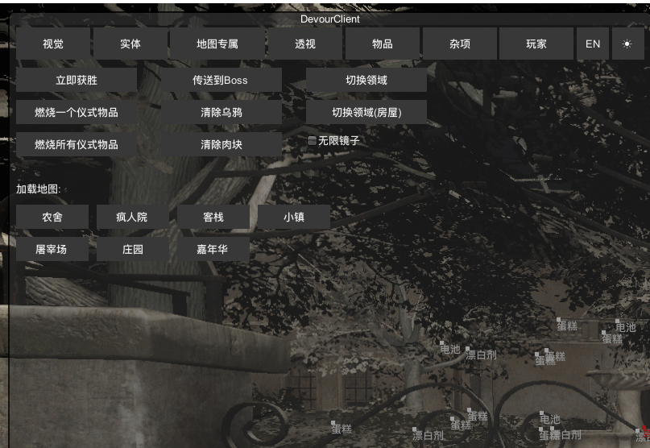

# DevourClient-MelonLoader

Devour 游戏的多功能辅助工具，支持中英双语界面。

## 功能特性

主要就是为前作者稍微进行了一下的维护,然后惠及一下和我一样害怕鬼的玩家,但是不推荐大家拿去多人模式欺负路人,好朋友除外。

## 中文安装指南

### 安装步骤

#### 第一步：安装 .NET 6 运行环境
下载地址：https://dotnet.microsoft.com/en-us/download/dotnet/6.0

选择 `Runtime` 版本下载并安装。

#### 第二步：安装 MelonLoader
1. 访问 https://github.com/LavaGang/MelonLoader/releases
2. 下载 `MelonLoader.Installer.exe`（建议使用 v0.6.4 版本）
3. 运行安装程序，选择 Devour 游戏路径
4. 点击 Install 进行安装

> 注意：安装过程中可能需要 VPN 支持

#### 第三步：安装插件
1. 从 Release 页面下载最新的 `DevourClient.dll`
2. 将文件放入游戏目录的 `Mods` 文件夹中
   - 游戏目录可通过 Steam 右键 Devour → 管理 → 浏览本地文件 找到
3. 完整路径示例：`Devour\Mods\DevourClient.dll`

#### 第四步：运行游戏
1. 首次启动会看到命令行窗口，等待 MelonLoader 完成初始化
2. 进入游戏后按 **DEL** 键打开/关闭菜单
3. 在菜单中选择语言切换为中文

---

## 常见问题

### Fatal Error 错误
**原因**：MelonLoader 安装文件损坏

**解决方案**：
1. 删除游戏目录下的 `MelonLoader` 文件夹
2. 重新运行 MelonLoader 安装程序

### 菜单无法打开
- 确认已正确安装 MelonLoader
- 确认 DLL 文件在 `Mods` 文件夹中
- 尝试按 DEL 键（非 INSERT 键）

### 游戏闪退
- 确认安装了正确版本的 .NET 6
- 确认 MelonLoader 版本兼容（推荐 v0.6.4）

---

## 开发者指南

### 环境配置

#### 1. 安装开发工具
- Visual Studio 2022 或更高版本
- .NET 6 SDK

#### 2. 克隆项目
```bash
git clone https://github.com/mizutop/DevourClient.git
```

#### 3. 安装 MelonLoader 到游戏
按照上述安装步骤，确保游戏目录下生成了 `MelonLoader` 文件夹和 `Il2CppAssemblies` 文件夹。

#### 4. 添加引用
在 Visual Studio 中添加以下引用：

**MelonLoader 核心文件** (`游戏目录\MelonLoader\net6\`)：
- MelonLoader.dll
- 0Harmony.dll
- Il2CppInterop.Runtime.dll

**游戏程序集** (`游戏目录\MelonLoader\Il2CppAssemblies\`)：
- Assembly-CSharp.dll
- Il2Cppmscorlib.dll
- UnityEngine.dll
- UnityEngine.CoreModule.dll
- UnityEngine.UI.dll
- UnityEngine.UIModule.dll
- UnityEngine.IMGUIModule.dll
- UnityEngine.InputLegacyModule.dll
- UnityEngine.AnimationModule.dll
- UnityEngine.PhysicsModule.dll
- Il2CppOpsive.UltimateCharacterController.dll
- Il2CppBehaviorDesigner.Runtime.dll
- Il2Cppbolt.user.dll
- Il2Cppbolt.dll
- Il2Cppudpkit.common.dll
- Il2Cppudpkit.dll
- Il2Cppudpkit.platform.photon.dll
- Il2Cppcom.rlabrecque.steamworks.net.dll
- unity.TextMeshPro.dll

#### 5. 构建项目
```bash
dotnet build -c Release
```

输出文件：`DevourClient\bin\Release\net6.0\DevourClient.dll`

---
## 卸载

删除游戏目录下的以下文件夹和文件：
- `MelonLoader/`
- `Mods/`
- `Plugins/`
- `UserData/`
- `version.dll`

---

## 致谢

- 原作者：[ALittlePatate](https://github.com/ALittlePatate/DevourClient)
- MelonLoader：https://github.com/LavaGang/MelonLoader
- dnSpy：https://github.com/dnSpy/dnSpy

---

## 许可证

[GPL 3.0](https://www.gnu.org/licenses/gpl-3.0.md)
